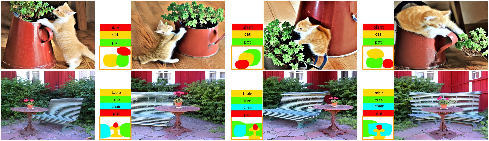

# Continuous Layout Editing of Single Images with Diffusion Models



Zhiyuan Zhang $^{1*}$, Zhitong Huang $^{1*}$, [Jing Liao](https://liaojing.github.io/html/) $^{1\dagger}$

<font size="1"> $^1$: City University of Hong Kong, Hong Kong SAR
<font size="1"> $^*$: Both authors contributed equally to this research &nbsp;&nbsp; $^\dagger$: Corresponding author </font>

## Abstract:
Recent advancements in large-scale text-to-image diffusion models have enabled many applications in image editing. However, none of these methods have been able to edit the layout of single existing images. To address this gap, we propose the first framework for layout editing of a single image while preserving its visual properties, thus allowing for continuous editing on a single image. Our approach is achieved through two key modules. First, to preserve the characteristics of multiple objects within an image, we disentangle the concepts of different objects and embed them into separate textual tokens using a novel method called masked textual inversion. Next, we propose a training-free optimization method to perform layout control for a pre-trained diffusion model, which allows us to regenerate images with learned concepts and align them with user-specified layouts. As the first framework to edit the layout of existing images, we demonstrate that our method is effective and outperforms other baselines that were modified to support this task. Our code will be freely available for public use upon acceptance.

## Installation

```pip install -r requirements.txt ``` 

We test on a single V100 GPU, you can set the iv_train_batch_size:2, iv_gradient_accumulation_steps:2, ft_train_batch_size:2, ft_gradient_accumulation_steps:1 to train on GPU with 20G memory

## Usage

1. Prepare the input image, mask image, target layout images and semantic dict(for example, in the sample/image1 folder, semantic_dict.json specify the color mapping: cat -> yellow(75,254,1), pot -> green(251,1,1) and plant -< red(251,1,1).)

2. Retrieve images for regularization

   ```bash
   python utils/retrieve.py --target_name "cat+pot+plant" --outpath real_reg --num_class_images 200
   ```

3. Single Image Learning

   ```bash
   accelerate launch run_learning.py --train_prompt "A high quality picture of cat, pot and plant" \
       --scale_lr --with_prior_preservation --image_path samples/image1/image.png \
       --mask_image samples/image1/mask.png \
       --semantic_dict samples/image1/semantic_dict.json \
       --iv_initializer_tokens "cat+pot+plant" \
       --addition_tokens "sks+uy" \
       --output_dir samples/image1/outputs/embeds \
       --iv_max_train_steps 200 \
       --ft_max_train_steps 800 \
       --iv_lr 5e-4 \
       --ft_lr 1e-5 \
       --iv_train_batch_size 4 \
       --iv_gradient_accumulation_steps 1 \
       --ft_train_batch_size 2 \
       --ft_gradient_accumulation_steps 1 \
       --report_to="wandb"
   ```

4. Continuous Layout Editing

```bash
python run_sample.py --prompt "A high quality picture of <cat>, <pot> and <plant>" \
    --image_path samples/image1/image.png \
    --mask_image samples/image1/mask.png \
    --target_layout samples/image1/target_layout/layout1.png \
    --semantic_dict samples/image1/semantic_dict.json \
    --delta_ckpt samples/image1/outputs/embeds/fine_tune/delta.bin \
    --output_dir samples/image1/outputs/images \
    --blend_steps 15

python run_sample.py --prompt "A high quality picture of <cat>, <pot> and <plant>" \
    --image_path samples/image1/image.png \
    --mask_image samples/image1/mask.png \
    --target_layout samples/image1/target_layout/layout2.png \
    --semantic_dict samples/image1/semantic_dict.json \
    --delta_ckpt samples/image1/outputs/embeds/fine_tune/delta.bin \
    --output_dir samples/image1/outputs/images2 \
    --blend_steps 15

python run_sample.py --prompt "A high quality picture of <cat>, <pot> and <plant>" \
    --image_path samples/image1/image.png \
    --mask_image samples/image1/mask.png \
    --target_layout samples/image1/target_layout/layout3.png \
    --semantic_dict samples/image1/semantic_dict.json \
    --delta_ckpt samples/image1/outputs/embeds/fine_tune/delta.bin \
    --output_dir samples/image1/outputs/images3 \
    --blend_steps 15
```

## UI

```bash
gradio app.py
```

1. Put the regularization dataset under the real_reg folder first. 
2. Upload the image, draw the target layout, fill in all the texts and then press GetColor. 
3. Assign object to color and then press submit. The first run will be longer as learning code is runned.
4. Press clear and try more layout!(or you can press GetColor and submit to get a new image using current layout)

### checkpoints

cat_pot_plant: https://drive.google.com/file/d/1PA49yIjM_7fh97iPzYTABYpVw8OUJWFU/view?usp=sharing
